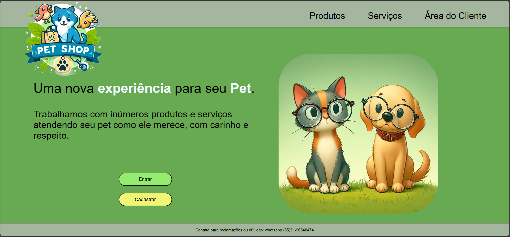

<h1 align="center">Fundamentos de Sistemas Web  - Fase 2</h1>

Projeto individual disciplina de Fundamentos de Sistemas Web - PUCRS

  

  <a href="#-tecnologias">Tecnologias</a>&nbsp;&nbsp;&nbsp;|&nbsp;&nbsp;&nbsp;
  <a href="#-projeto">Projeto</a>&nbsp;&nbsp;&nbsp;|&nbsp;&nbsp;&nbsp;
  <a href="https://martinsgui.github.io/Fundamentos-Web/home.html">Visualizar o Projeto</a>&nbsp;&nbsp;&nbsp;

 

## 🚀 Tecnologias

Tecnologias empregadas:

- HTML
- CSS
- JavaScript
- Git e Github

## 💻 Projeto

O Projeto do Mercado consiste na criação de uma plataforma online para um PetShop, abrangendo todas as fases de planejamento e desenvolvimento, conforme abordado durante as aulas, na primeira etapa foram desenvolvidos protótipos, objetivos, metas entre outros para que na segunda faze fosse desenvolvido esta etapa.
obs.: Algumas opções de navegação não foram desenvolvidas, utilizar a tela na resolução de 80%, para ficar na resolução adequada hahaha, acabei me dando conta que configurei errado o projeto, já peço desculpas.

